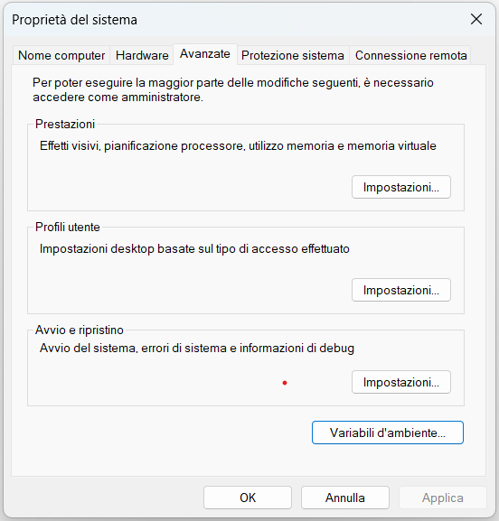
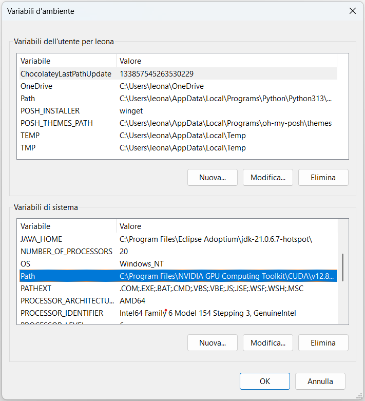
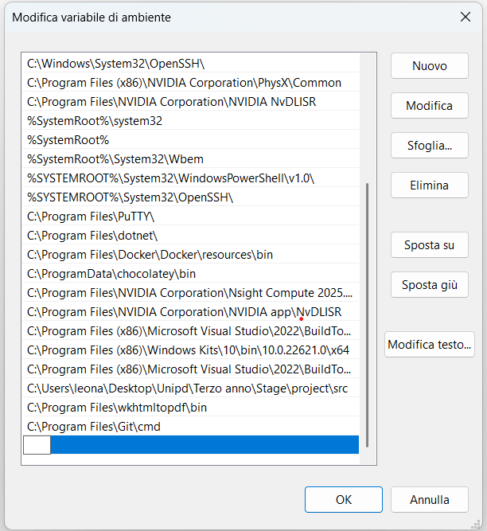

# GRIT

## 1 - Introduzione

**GRIT** è un plugin per Git scritto in **Python**, pensato per semplificare l'interazione con Git attraverso l'uso del linguaggio naturale. Il plugin sfrutta le potenzialità dei **LLM (Large Language Models)** per:

- Generare comandi Git a partire da descrizioni in linguaggio naturale fornite dall’utente;
- Creare commenti di commit templatizzati, basati sulle modifiche effettivamente apportate alla codebase e su eventuali indicazioni dell’utente.

## 2 - Requisiti Tecnologici

Per utilizzare **GRIT** in modo corretto ed efficiente, è necessario che il sistema in uso soddisfi i seguenti requisiti hardware e software.

### Requisiti Software

- **Ollama** ≥ 0.6.6  
  È necessario che sulla macchina sia attivo:
  - Un **modello di embedding** compatibile: `nomic-embed-text`
  - Un **modello LLM general-purpose** (il modello usato durante la creazione e il testing del software è `Qwen3`
   (quantizzato, 4B parametri))

- **Python** ≥ 3.13.0  
  È richiesto un interprete Python aggiornato e compatibile con le librerie utilizzate e indicate a seguire.

- **Sistema Operativo**:  
  - Solo **Windows**, versione **10 o superiore**.

### 2.1 - Librerie Python Necessarie

Le seguenti librerie devono essere installate nell’ambiente Python per garantire il corretto funzionamento del plugin:

| Libreria     | Descrizione                                                                 |
|--------------|-----------------------------------------------------------------------------|
| `colorama`   | Per il supporto alla colorazione cross-platform del testo nel terminale     |
| `attrs`      | Utility per la dichiarazione e gestione di classi basate su attributi       |
| `PyMuPDF`    | Parsing e gestione dei file PDF, utile per l’analisi di documenti           |
| `ollama`     | Client per interfacciarsi con il servizio Ollama                            |
| `chromadb`   | Database vettoriale per la gestione della memoria semantica                 |
| `rank_bm25`  | Algoritmo BM25 per il ranking semantico basato su similarità testuale       |

## 3 - Installazione

### 3.1 - Scarica il progetto

È sufficiente scaricare l’ultima **release** disponibile dal [repository GitHub](<https://github.com/Aniysi/GRIT>) (assicurati che includa le cartelle `src/` e `chroma_db/`).


### 3.2 - Posiziona i file

<a name="32"></a>
Estrai i file in una cartella a tua scelta nel file system di Windows.

### 3.3 - Aggiungi la directory `src/` alla variabile di ambiente **Path**

A seguire sono indicati due metodi alternativi per l'aggiunta della cartella `src/` alla variabile **Path**.

#### 3.3.1 - Primo metodo (guidato)

1. Copia il percorso della cartella `src/`;
2. Cerca **Modifica le variabili di ambiente relative al sistema** tramite la ricerca di Windows;
3. Clicca sul primo risultato per aprire il pannello **Proprietà di sistema**;
4. Nella finestra **Proprietà di sistema**, clicca su **Variabili d’ambiente...**;

<p align="center">
  
</p>

5. Nella sezione inferiore della finestra **Variabili d’ambiente**, seleziona la variabile `Path` e clicca su **Modifica...**;

<p align="center">
  
</p>

6. Nella finestra **Modifica variabile d’ambiente**, clicca su **Nuovo** e incolla il percorso della cartella `src/`;

<p align="center">
  
</p>

7. Conferma le modifiche cliccando su **OK** in tutte le finestre aperte.

Il percorso è ora correttamente impostato e il plugin è pronto all’uso.

#### 3.3.2 - Secondo metodo (ufficiale)

Alternativamente è possibile aggiungere la cartella `src/` alle variabili di sistema seguendo la guida ufficiale offerta da Microsoft, e disponibile all'indirizzo <https://learn.microsoft.com/it-it/windows/powertoys/environment-variables#editremove-variable>

### 3.4 - Setup dell’Ambiente Virtuale Python

Per garantire l’isolamento delle dipendenze e un'esecuzione stabile del plugin **GRIT**, si consiglia di configurare un **ambiente virtuale Python** all’interno della cartella `src/`. Di seguito è indicato come fare.

1. Posizionati nella cartella in cui sono stati precedentemente estratti i file ([Vedi sezione 3.2](#32)). La cartella dovrebbe avere la seguente struttura:

```bash
choosen_directory/
├── chroma_db/
├── src/
└── requirements.txt
```

2. Crea l'ambiente virtuale python eseguendo il seguente comando a terminale:

```bash
python -m venv venv
```

3. Esegui l'ambiente virtuale python attraverso il seguente comando a terminale:

```bash
venv/Scripts/activate
```

4. Scarica le dipendenze necessarie per usufruire del software eseguendo a terminale il seguente comando:

```bash
pip install -r requirements.txt
```

## 4 - Utilizzo del Plugin

Il plugin **GRIT** consente l'interazione con un modello linguistico (LLM) tramite richieste in linguaggio naturale, che vengono interpretate e convertite in comandi Git eseguibili.

### 4.1 - Avvio

Una volta completata la configurazione e aggiunta la directory `src/` al `Path` di sistema, è possibile avviare GRIT da qualsiasi terminale e da qualsiasi posizione del file system Windows. Per avviare il plugin, è sufficiente digitare:

```bash
grit
```

e premere invio.

### 4.2 - Modalità di utilizzo

All'avvio, GRIT entra in una modalità interattiva (chat) con il modello LLM. L'utente può digitare richieste in linguaggio naturale, come ad esempio: *crea un nuovo branch chiamato "feature/login"*.

Il modello restituirà un comando Git coerente con la richiesta, insieme a una breve spiegazione.

>Nota: ogni nuova richiesta non preceduta da un comando (/exec, /fix, ecc.) annulla il contesto della richiesta precedente. Il plugin non mantiene lo stato della conversazione.

### 4.2.1 - Esecuzione dei comandi

Dopo che GRIT ha proposto un comando Git, è possibile eseguirlo utilizzando il comando:

```bash
/exec
```

Se l'esecuzione ha successo, il terminale tornerà alla modalità di attesa per una nuova richiesta.
Se l'esecuzione fallisce, GRIT stamperà il messaggio d'errore restituito dal sistema. A quel punto, l'utente può:
 - Inviare una nuova richiesta, oppure
 - Correggere il comando proposto utilizzando il comando:

 ```bash
/fix
```

GRIT genererà una nuova versione corretta del comando precedente, basandosi sull'errore restituito.

### 4.2.2 - Raffinamento del comando

È possibile anche indicare direttamente al modello come rifinire il comando generato secondo le proprie necessità attraverso il comando:

```bash
/refine <query>
```

Dove `<query>` è una descrizione in linguaggio naturale delle modifiche da applicare (es. *"rimuovi il flag --force"* o *"cambia il nome del branch in develop"*).

### 4.2.3 - Terminare la sessione

In qualsiasi momento è possibile terminare la sessione con il comando:

```bash
/quit
```

Questo chiuderà il plugin e uscirà dalla modalità interattiva.