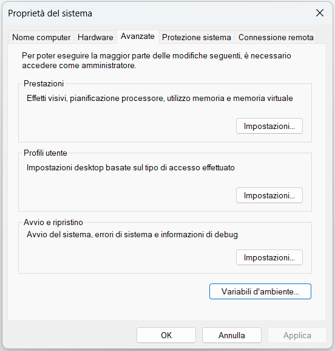
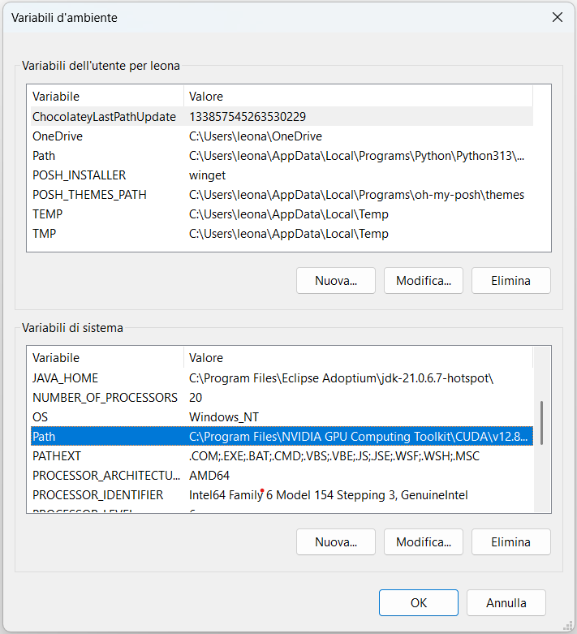
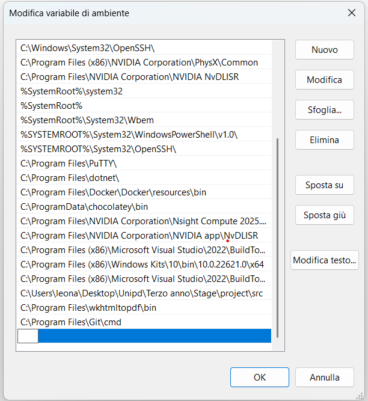

# Gini

## 1 - Introduction

**Gini** is a Git plugin written in **Python**, designed to simplify interaction with Git through the use of natural language. The plugin leverages the power of **LLMs (Large Language Models)** to:

- Generate Git commands from natural language descriptions provided by the user;
- Create commit comments based on changes actually made to the codebase and any user indications;
- Analyze the impact of changes made to a file before uploading to the remote repository;
- Resolve simple merge conflicts using LLM.

## 2 - Technical Requirements

To use **Gini** correctly and efficiently, the system must meet the following hardware and software requirements.

### Software Requirements

- **Ollama** ≥ 0.6.6  
  The machine must have active:
  - A **general-purpose LLM model** (there are no precise guidelines for model selection, but generally a model with coding capabilities and power equal to or greater than Qwen 3 quantized with 4 billion parameters is recommended (used during software creation and testing)).

- **Python** ≥ 3.13.0  
  An updated Python interpreter compatible with the libraries used and indicated below is required.

- **Operating System**:  
  - **Windows only**, version **10 or higher**.

### 2.1 - Required Python Libraries

The following libraries must be installed in the Python environment to ensure proper plugin functionality:

| Library        | Description                                                                 |
|----------------|-----------------------------------------------------------------------------|
| `colorama`     | Cross-platform text coloring support in terminal                            |
| `attrs`        | Utilities for declaring and managing attribute-based classes                |
| `PyMuPDF`      | PDF file parsing and management, useful for document analysis               |
| `ollama`       | Client for interfacing with Ollama service                                  |
| `chromadb`     | Vector database for semantic memory management                              |
| `rank_bm25`    | BM25 algorithm for semantic ranking based on textual similarity             |
| `pytest`       | Framework for automated code testing                                        |
| `pytest-cov`   | Plugin for generating code coverage reports during tests                    |
| `GitPython`    | Python interface for interacting with Git repositories                      |

## 3 - Installation

### 3.1 - Download the project

Simply download the latest **release** available from the [GitHub repository](<https://github.com/Aniysi/Gini>) (make sure it includes the `src/` and `chroma_db/` folders).


### 3.2 - Position the files

<a name="32"></a>
Extract the files to a folder of your choice in the Windows file system.

### 3.3 - Add the `src/` directory to the **Path** environment variable

Below are two alternative methods for adding the `src/` folder to the **Path** variable.

#### 3.3.1 - First method (guided)

1. Copy the path of the `src/` folder;
2. Search for **Edit the system environment variables** through Windows search;
3. Click on the first result to open the **System Properties** panel;
4. In the **System Properties** window, click on **Environment Variables...**;

<p align="center">
  
</p>

5. In the lower section of the **Environment Variables** window, select the `Path` variable and click **Edit...**;

<p align="center">
  
</p>

6. In the **Edit environment variable** window, click **New** and paste the path of the `src/` folder;

<p align="center">
  
</p>

7. Confirm the changes by clicking **OK** in all open windows.

The path is now correctly set and the plugin is ready for use.

#### 3.3.2 - Second method (official)

Alternatively, you can add the `src/` folder to system variables by following the official guide provided by Microsoft, available at <https://learn.microsoft.com/en-us/windows/powertoys/environment-variables#editremove-variable>

### 3.4 - Python Virtual Environment Setup

To ensure dependency isolation and stable execution of the **Gini** plugin, it is recommended to configure a **Python virtual environment** within the `src/` folder. Here's how to do it.

1. Navigate to the folder where the files were previously extracted ([See section 3.2](#32)). The folder should have the following structure:

```bash
chosen_directory/
├── chroma_db/
├── src/
└── requirements.txt
```

2. Create the Python virtual environment by executing the following command in terminal:

```bash
python -m venv venv
```

3. Activate the Python virtual environment with the following terminal command:

```bash
venv/Scripts/activate
```

4. Download the necessary dependencies to use the software by executing the following command in terminal:

```bash
pip install -r requirements.txt
```

## 4 - Plugin Usage

The **Gini** plugin provides four distinct usage modes:

- Creating Git commands - use the plugin to create and execute Git commands from natural language querys;
- Creating commit messages - use the plugin to automate LLM-based generation of commit comments (title and body) through analysis of files in the staging area and direct interaction with the developer through questions about changes made;
- Changes impact analisys - use the plugin to create reports on the impact that changes made to a file can have on the remote repository and their security;
- Solving merge conflicts - use the plugin for automated resolution of simple merge conflicts.

### 4.1 - Creating Git Commands

#### 4.1.1 - Startup

Once configuration is complete and the `src/` directory is added to the system `Path`, you can start Gini from any terminal and from any location in the Windows file system. To start generating git commands, simply type:

```bash
gini cmd
```

and press enter.

#### 4.1.2 - Usage Mode

On startup, Gini enters an interactive mode (chat) with the LLM model. The user can type requests in natural language, such as: *create a new branch called "feature/login"*.

The model will return a Git command consistent with the request, along with a brief explanation.

>Note: each new request not preceded by a command (/exec, /fix, etc.) cancels the context of the previous request. The plugin does not maintain conversation state.

#### 4.1.2.1 - Command Execution

After Gini has proposed a Git command, it can be executed using the command:

```bash
/exec
```

If execution succeeds, the terminal will return to waiting mode for a new request.
If execution fails, Gini will print the error message returned by the system. At that point, the user can:

- Send a new request, or
- Correct the proposed command using the command:

 ```bash
/fix
```

Gini will generate a new corrected version of the previous command, based on the returned error.

#### 4.1.2.2 - Command Refinement

It's also possible to directly instruct the model on how to refine the generated command according to your needs through the command:

```bash
/refine <query>
```

Where `<query>` is a natural language description of the changes to be applied (e.g. *"remove the --force flag"* or *"change the branch name to develop"*).

#### 4.1.2.3 - Terminating the session

At any time, you can terminate the session with the command:

```bash
/quit
```

This will close the plugin and exit interactive mode.

### 4.2 - Creating commit messages

#### 4.2.1 - Startup

Once you have changed your codebase and added all files you want to commit to the staging area, start generating the commit comments by simply typing:

```bash
gini commit
```

on any terminal and press enter.

>Note: you need to be inside of a Git repository and have staged files to access this feature.

#### 4.2.2 - Usage Mode

On startup, Gini retrives all staged files and provides them to the LLM. The LLM can either generate and display a commit messagge regarding user changes, or ask the user some questions regarding the staged files. When the LLM has enugh informations it will generate the commit message to display on bash.

#### 4.2.2.1 - Commit execution

If you are satisfied with the message produced by the LLM you can commit all staged changes exectuing the following command:

```bash
/commit
```

If the commit is succesfull a message will be displayed and the session will be temrinated.

#### 4.2.2.2 - Commit refinement

If you are not satisfied with the generated message you can provide some corrections by executing the command:

```bash
/commit
```

followed by a refinement query. This will restart the message genration providing new info to the LLM. The LLM could again ask the user some question.

#### 4.2.2.3 - Terminating the session

At any time, you can terminate the session with the command:

```bash
/quit
```

This will close the plugin and exit interactive mode.

### 4.3 - Changes impact analisys

> **⚠️ Warning**: this feature is currently in experimental stage, and due to the limitations of the LLM used may not function reliably. Results may be inconsistent or incomplete.


#### 4.3.1 - Usage

Once you have changed your codebase and added all updated files to the staging area you can ask the LLM to analyze a specific staged file in order to understand the impact your chages will have on the remote repository, amd possible security breaches your file introduces. To do so, type on your bash:

```bash
gini impact .\file\path
```

This will provide a detailed description of effect your changes could have on the repository and a rating of their security (value from 1 to 10 - 1 represents high risk; 10 represents low risk).

>Note: due to the high complexity of this task, the command can be executed on a single file at a time.

### 4.4 - Solving merge conflicts

#### 4.4.1 - Usage

The plugin also provides a functionality to automatically solve merge conflicts derived, for example, from pulling remote changes on your local branch. This functionality can be accessed by executing on your bash the following command:

```bash
gini merge .\path\to\file\or\directory
```

And it will automatically fetch current and incoming changes of each file affected by the command and ask the LLM to merge them. The LLM can choose not to solve a specific merge when it's deemed to complex for its own capabilities, but will otherwise edit and commit all affected files.

> **⚠️ Warning**: this feature is the only one which actually edits your files, so keep in mind the LLM won't necessarily be able to solve conflicts and it may also introduce mistakes while doing so.

## 5 - Configuration

The plugin offers some configuration options regarding some of the key aspects of its usage. Specifically it is possible to:

- Specify the output languge of all plugin answers
- Select the Ollama model you want to use

For more advanced configuration options (for example specify your machine Ollama port if it's not the default one), it is suggested to directly modify the file `config.json` located at `src\config\config.py`

### 5.1 - Set output language

It is possible to set plugin output language for natural text using the command:

```bash
gini --set-output-language <preferred-natural-output-language>
```

### 5.2 - Set Ollama model

It is possible to set the Ollama model you want to use by typing on bash:

```bash
gini --set-model <your-ollama-model-name>
```